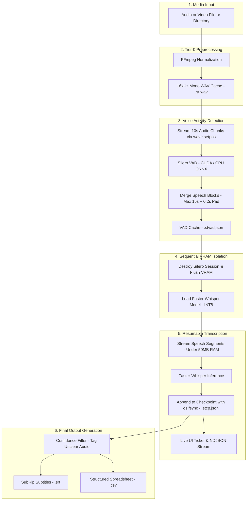

# Steno

A single-purpose, rock-solid CLI workhorse for transcribing long-form audio (up to 9+ hours) with zero RAM bloat, crash-proof JSONL resumability, dead-simple single-file or directory batching, and real-time live terminal feedback.

---

## Features

- **Constant ~50MB RAM Footprint**: Audio is streamed in 10-second chunks using Python's native `wave.setpos()`. Memory usage remains strictly flat regardless of audio duration (tested up to 9+ hours).
- **Zero Hallucination Loops**: Speech is pre-segmented with Silero VAD into continuous blocks (up to 15s) with `condition_on_previous_text=False`. Whisper is never exposed to dead air or static.
- **Sequential VRAM Allocation**: Dynamically creates and destroys the Silero ONNX session before loading the Whisper model. Flushes GPU memory between phases to prevent OOM errors on 4GB/6GB GPUs.
- **Zero SQLite / Crash-Proof Resumability**: State is tracked strictly in flat `.stcp.jsonl` files with an immediate `os.fsync()` after every transcribed segment. If interrupted or crashed, transcription picks up exactly where it left off.
- **Hardware Acceleration with Reliable Detection**: Uses physical `nvidia-smi` hardware polling (avoiding false positives from installed CUDA packages). Automatically selects CUDA `int8_float16` on NVIDIA GPUs or falls back to CPU `int8`.
- **Proof-of-Life Live UI**: Built with `rich.live.Live` featuring progress bars, speed factor (e.g. `2.4x real-time`), elapsed time, ETA, and live decoded text. A background ticker thread prevents UI freezes during CTranslate2 C++ GIL locking.
- **Unicode Terminal Width Hardening**: Python-level string truncation guarantees complex foreign scripts (e.g., Tamil, Arabic) never wrap or break terminal cursor tracking.
- **Batch Processing with Transient Panels**: Point Steno at a directory containing 50+ files; finished file panels evaporate cleanly to keep terminal output clutter-free.
- **NDJSON Stream Support**: The `--json-stream` flag suppresses all terminal UI and outputs structured NDJSON events to `stdout` for external integrations (Electron, Tauri, web APIs).
- **Dual Formats with Confidence Filtering**: Automatically exports `.srt` subtitles and `.csv` spreadsheets, replacing low-confidence tokens with `[UNCLEAR_AUDIO]`.

---

## Architecture & Pipeline



---

## Architecture & Engineering Highlights

### 1. Memory Safety via `wave.setpos()`
Traditional audio processing libraries (such as `librosa` or `soundfile`) load complete audio files into memory arrays, which crashes on long-form audio (several hours of raw 16kHz audio can require gigabytes of RAM). Steno converts media into a standardized 16kHz mono `.st.wav` intermediate cache and streams it in 10-second windows using `wave.setpos()`. As a result, RAM consumption stays flat at approximately **50MB** whether processing a 3-minute voice memo or a 9-hour recording.

### 2. Silero VAD + Whisper Synergy
Feeding continuous audio directly into Whisper causes severe hallucination loops during silent intervals or background noise. Steno solves this by running an initial pass using Silero VAD (ONNX Runtime). Contiguous speech frames are merged into natural blocks up to 15 seconds long with 0.2-second padding. Whisper only processes verified speech segments, and `condition_on_previous_text=False` is strictly enforced to isolate inference context.

### 3. Sequential VRAM Allocation
Running Silero VAD and Whisper concurrently on consumer GPUs (e.g. 4GB or 6GB VRAM) risks out-of-memory errors. Steno uses strict sequential lifecycle management:
1. The Silero ONNX runtime session is initialized (with CUDA if available).
2. The complete VAD cache (`.stvad.json`) is generated.
3. The Silero session is explicitly destroyed and Python garbage collection flushes the GPU memory context.
4. The Faster-Whisper CTranslate2 model is loaded into clean VRAM.

### 4. Crash-Proof Flat JSONL Checkpointing
Steno eschews databases like SQLite in favor of flat JSONL files (`.stcp.jsonl`). Each completed segment is appended and flushed to disk using `os.fsync()`. If the machine loses power, crashes, or the user hits `Ctrl+C`, no data is lost. Upon restarting, Steno loads the checkpoint and seamlessly resumes from the next uncompleted segment.

### 5. Non-Blocking Proof-of-Life UI
The CTranslate2 C++ engine locks the Python GIL during inference. Steno decouples UI rendering by running an asynchronous ticker thread that calculates elapsed time, real-time speed factors, and remaining ETA while the inference engine decodes. In addition, `rich.live.Live` panels are configured with `transient=True` in batch mode so completed files roll up cleanly into single-line summaries.

### 6. Unicode Terminal Width Hardening
Terminal emulators frequently miscalculate the display column width of complex graphemes (e.g., Tamil, Arabic, Thai). If a preview string wraps unexpectedly, `rich` loses its cursor position, creating a cascading visual glitch. Steno hard-truncates the live preview text to a maximum of 50 characters at the raw Python string level, preventing line wraps across all terminal types.

---

## Supported Media Formats

Steno accepts single files or directories containing:
- **Audio**: `.mp3`, `.m4a`, `.wav`, `.aac`, `.flac`, `.ogg`
- **Video**: `.mp4`, `.mkv`, `.mov`, `.webm`

---

## Installation

### Prerequisites

1. **Python**: Version 3.10 or higher.
2. **uv**: Recommended fast package installer ([astral-sh/uv](https://github.com/astral-sh/uv)).
3. **FFmpeg**: Must be available on your system `PATH` or placed directly as `ffmpeg.exe` in the project root directory.

#### Installing FFmpeg on Windows
```powershell
winget install gyan.ffmpeg -v 7.0.2
```
*(Restart your terminal after installation, or place `ffmpeg.exe` in the repository root).*

#### Installing FFmpeg on macOS
```bash
brew install ffmpeg
```

#### Installing FFmpeg on Linux (Ubuntu/Debian)
```bash
sudo apt update && sudo apt install ffmpeg
```

### Install Dependencies

```bash
uv sync
```

---

## Usage

### Single File Transcription

```bash
uv run steno podcast.m4a
```

### Batch Directory Transcription

```bash
uv run steno ./interviews_folder/
```

### Retranscribing (Clearing Checkpoints)

If you wish to ignore previous progress and re-transcribe from the beginning:

```bash
uv run steno podcast.m4a --retranscribe
```

### Cleaning Intermediate Cache Files

To remove all intermediate files (`.st.wav`, `.stvad.json`, `.stcp.jsonl`) generated during transcription:

```bash
uv run steno podcast.m4a --clean
```

Or clean an entire directory:

```bash
uv run steno ./interviews_folder/ --clean
```

### Headless / NDJSON Streaming Mode

For UI wrappers (e.g. Electron, Tauri, Node.js, Python sub-processes), pass `--json-stream` to suppress Rich terminal output and receive real-time JSON events:

```bash
uv run steno lecture.mp3 --json-stream
```

Example JSON event output:
```json
{"event": "progress", "file": "lecture.mp3", "audio_duration_s": 3600.0, "current_audio_s": 450.2, "percent": 12.5, "speed_factor": 3.2, "elapsed_s": 140.7, "eta_s": 984.3, "latest_text": "Good morning everyone and welcome to...", "status": "Transcribing..."}
{"event": "complete", "file": "lecture.mp3", "output_file": "lecture.srt"}
```

---

## Command Line Options

| Option | Type | Default | Description |
|---|---|---|---|
| `PATH` | Argument | *(Required)* | Path to an audio/video file or a directory of media files. |
| `--model` | Text | `small` | Faster-whisper model size: `tiny`, `base`, `small`, `medium`, `large-v3`. |
| `--min-confidence` | Float | `0.6` | Words with confidence scores below this threshold are marked `[UNCLEAR_AUDIO]`. |
| `--retranscribe` | Flag | `False` | Forces Steno to clear existing checkpoints and re-transcribe from scratch. |
| `--clean` | Flag | `False` | Deletes intermediate cache files (`.st.wav`, `.stvad.json`, `.stcp.jsonl`) and exits. |
| `--json-stream` | Flag | `False` | Suppresses terminal UI and streams NDJSON progress events to `stdout`. |

---

## Output Files

For each processed file (e.g. `recording.mp3`), Steno produces:

1. **`recording.srt`**: Standard SubRip subtitle format with accurate timestamps and unclear audio labels:
   ```srt
   1
   00:00:01,200 --> 00:00:04,800
   Welcome to the deep learning seminar.

   2
   00:00:05,100 --> 00:00:07,450
   [UNCLEAR_AUDIO]
   ```

2. **`recording.csv`**: Structured spreadsheet containing start/end timestamps, transcribed text, and confidence scores:
   ```csv
   start,end,text,confidence
   1.2,4.8,Welcome to the deep learning seminar.,0.941
   5.1,7.45,[UNCLEAR_AUDIO],0.421
   ```

3. **Intermediate Caches** (kept for fast re-runs and instant resumption):
   - `recording.st.wav`: 16kHz mono audio cache.
   - `recording.stvad.json`: Speech segment timestamps from Silero VAD.
   - `recording.stcp.jsonl`: Incremental transcription checkpoint.

---

## First Run & Hardware Notes

- **Model Caching**: On the initial run, Steno automatically downloads the Silero VAD ONNX model to `~/.cache/steno/` and the specified Whisper model via Hugging Face. Subsequent runs execute completely offline.
- **NVIDIA GPU Detection**: If an NVIDIA GPU is detected via `nvidia-smi`, Steno automatically executes with CUDA acceleration (`CUDAExecutionProvider` for VAD and `int8_float16` for Whisper).
- **CPU Fallback**: On CPU-only machines, Steno seamlessly runs with `CPUExecutionProvider` and `int8` CPU quantization. Model loading into system RAM on CPU takes 10-30 seconds during initialization.

---

## Documentation & Deep Dives

For in-depth contributor standards, edge cases, and engineering analysis:
- **[Architectural & Development Guidelines](docs/guidelines.md)**: Rules for memory constraints, zero SQLite checkpointing, VRAM flushing, and UI decoupling.
- **[Pitfalls, Edge Cases & Lessons Learned](docs/pitfalls.md)**: Breakdown of C++ GIL locks, GPU detection false positives, terminal unicode line-wrap bugs, and solutions.

---

## License

This project is licensed under the terms of the [MIT License](LICENSE.md).
